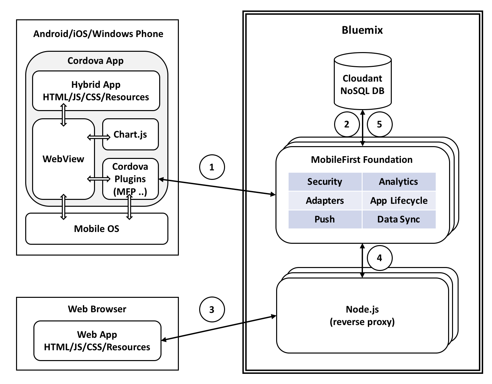

**Note**: This is a work in progress.

# Creating Mobile Charts for showing aggregate statistics from Cloudant Map Reduce Views

1. Mobile app makes a call to MobileFirst adapter to fetch aggregate statistics from Cloudant NoSQL DB.
2. MobileFirst adapter makes a REST API call to Cloudant's map reduce views to fetch the aggregate statistics and returns it to the mobile app.
3. Mobile app displays the aggregate statistics as charts using Charts.js JavaScript library.
4. A different user submits a form on a web-app to create a new document or update an existing document. The web app posts this request to Node.js runtime.
5. The Node.js runtime proxies this request to MobileFirst server.
6. MobileFirst adapter finally posts the new/updated document to Cloudant NoSQL DB. The map reduce views on Cloudant self update the aggregate statistics so that the updated statistics are returned to the mobile app upon next request.
